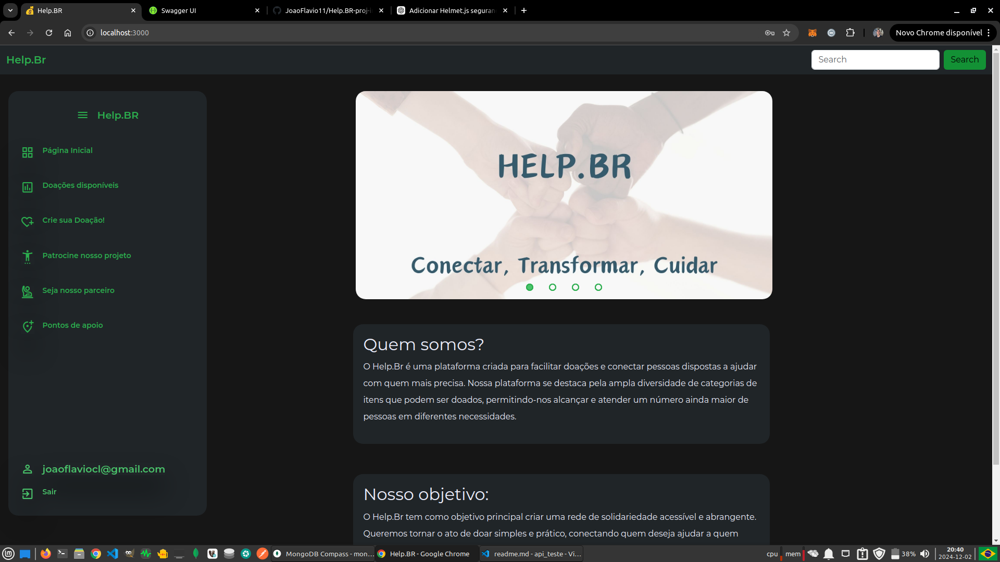
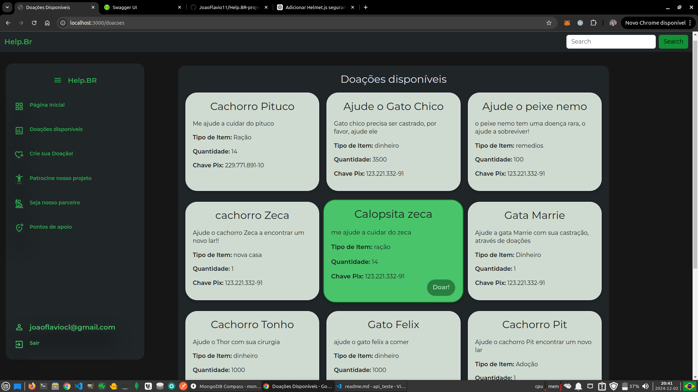
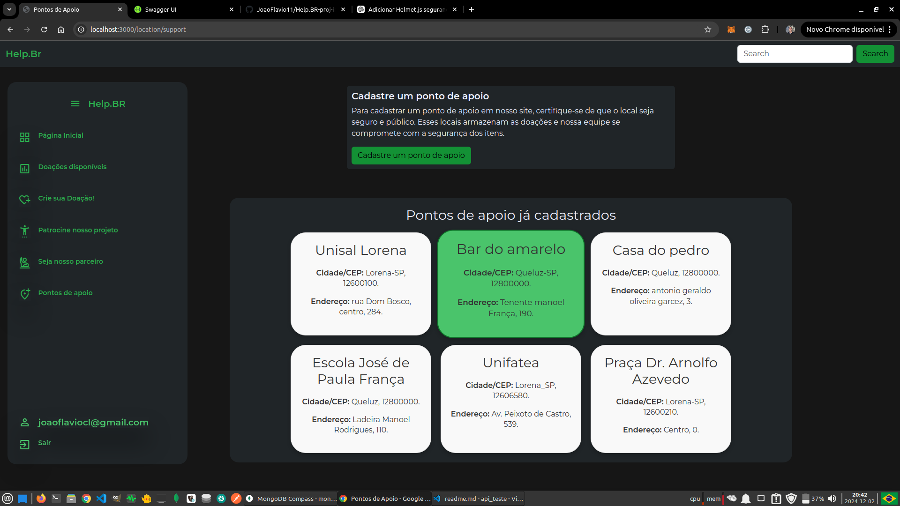
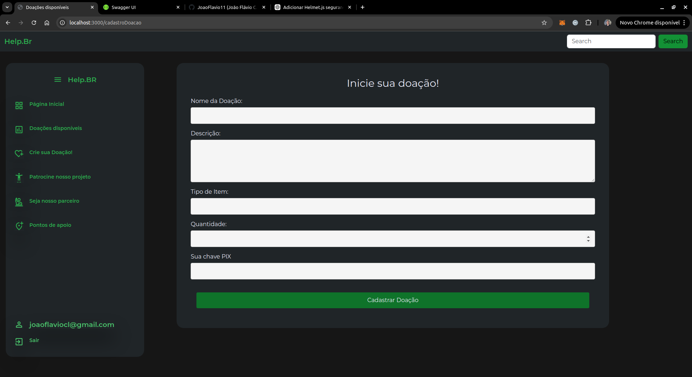

# Projeto Help.BR

Este é um projeto de **Plataforma de Doações Online** desenvolvido com Node.js, Express, MongoDB e TypeScript. O sistema permite que usuários se registrem, façam login e realizem doações por meio de um frontend integrado.

Desenvolvemos este projeto para nosso projeto integrador do 6º semestre, criamos a **API** em **TypeScript** utilizando a estrutura **MVC**, implementando práticas modernas como cache com Redis, logging com Winston, e middlewares personalizados para validação e tratamento de erros. Além disso, seguimos o padrão REST para organização das rotas e integração com o MongoDB para persistência de dados. O objetivo principal foi criar uma plataforma eficiente e escalável para gerenciar doações de maneira segura e intuitiva.

## 📁 Estrutura do Projeto

A estrutura do projeto está organizada da seguinte forma:

```
├── logs/                    # Arquivos de logs gerados pelo sistema
├── node_modules/            # Dependências do projeto
├── public/
│   ├── assets/              # Recursos estáticos (imagens, fontes, etc.)
│   ├── css/                 # Arquivos de estilo CSS
│   ├── firebase/            # Configuração do Firebase
│   ├── html/                # Páginas HTML
│   ├── js/                  # Scripts JavaScript para o frontend
├── src/
│   ├── controllers/         # Controladores da aplicação
│   ├── database/            # Configuração e conexão com o banco de dados
│   ├── middlewares/         # Middlewares para processamento de requisições
│   ├── models/              # Modelos de dados
│   ├── repositories/        # Lógica de acesso ao banco de dados
│   ├── routers/             # Definição das rotas da API
│   ├── utils/               # Funções utilitárias
│   ├── index.ts             # Ponto de entrada principal do backend
├── .env                     # Arquivo de variáveis de ambiente
├── swagger.yaml             # Documentação da API com Swagger
├── eslint.config.mjs        # Configuração do ESLint
├── package.json             # Configurações e dependências do projeto
├── tsconfig.json            # Configurações do TypeScript
├── yarn.lock                # Arquivo de dependências gerenciado pelo Yarn
```

---

## 🚀 Tecnologias Utilizadas

- **Node.js**: Backend da aplicação
- **Express.js**: Framework web para Node.js
- **MongoDB**: Banco de dados NoSQL
- **TypeScript**: Superconjunto de JavaScript
- **Firebase**: Autenticação
- **Swagger**: Documentação da API
- **Yarn**: Gerenciador de pacotes

---

## 📚 Funcionalidades

- **Cadastro e autenticação de usuários:**
  - Registre e autentique usuários com o Firebase Authentication.
  - Suporte para recuperação de senha e validação de email.

- **Gerenciamento de doações:**
  - Crie, edite e visualize doações detalhadas.
  - Visualize histórico de doações feitas por cada usuário.

- **Interface amigável:**
  - Layout responsivo com navegação intuitiva.
  - Detalhamento de cada doação, com descrição, imagens e informações relevantes.

- **Documentação interativa da API:**
  - Use o Swagger para explorar os endpoints disponíveis, testar rotas e entender a estrutura de dados.


---

## 📦 Instalação e Configuração

1. **Clone o repositório:**
   ```bash
   git clone https://github.com/JoaoFlavio11/Help.BR-proj-int-6
   cd Help.BR-proj-int-6
   ```

2. **Instale as dependências:**
   ```bash
   yarn install
   ```

3. **Configure o ambiente:**
   - Crie um arquivo `.env` baseado no modelo abaixo:
     ```
     PORT=3000
     MONGO_URI=sua-string-de-conexao-mongodb
     FIREBASE_API_KEY=sua-chave-firebase
     ```

4. **Inicie o servidor:**
   ```bash
   yarn start:dev
   ```

5. **Acesse o projeto:**
   - Frontend: `http://localhost:3000`
   - Documentação da API: `http://localhost:3000/api-docs`

---

## 🌐 Frontend

O frontend da aplicação está na pasta `public/` e contém arquivos HTML, CSS e JavaScript. Ele é integrado ao backend para comunicação com a API.

---

## 🛠️ Contribuindo

Se quiser contribuir, siga estas etapas:

1. Faça um fork do repositório.
2. Crie um branch para sua feature:
   ```bash
   git checkout -b minha-feature
   ```
3. Faça commit das alterações:
   ```bash
   git commit -m "Minha nova feature"
   ```
4. Envie para o repositório remoto:
   ```bash
   git push origin minha-feature
   ```
5. Abra um Pull Request.

---

## 🏗️ Arquitetura do Sistema

O projeto segue a seguinte arquitetura:

1. **Frontend:** HTML, CSS, e JS interagem com a API via requisições HTTP.
2. **Backend:** Implementado em Node.js, seguindo a estrutura MVC.
3. **Banco de Dados:** MongoDB é utilizado para persistir informações de usuários e doações.
4. **Cache:** Redis para armazenar dados temporários, otimizando a performance.

---

## 🔮 Futuras Implementações

- **Integração com gateway de pagamento** para permitir doações monetárias online.
- **Sistema de notificações** para alertar os usuários sobre novas campanhas ou atualizações de doações.
- **Dashboard administrativo** para gerenciar doações e usuários.
- **Melhorias no frontend** usando React ou Next.js para maior interatividade.

---

## ✅ Checklist do Projeto

- [x] Cadastro de usuários
- [x] Login e autenticação com Firebase auth
- [x] Criação de doações
- [ ] Integração com gateway de pagamento
- [ ] Sistema de notificações
- [ ] Dashboard administrativo


---

## 📎 Referências

- [Node.js](https://nodejs.org/)
- [Express.js](https://expressjs.com/)
- [MongoDB](https://www.mongodb.com/)
- [TypeScript](https://www.typescriptlang.org/)
- [Swagger](https://swagger.io/)
- [Redis](https://redis.io/)

---

## 👥 Contribuidores

Agradecemos a todos que contribuíram para este projeto!

- [João Flávio](https://github.com/JoaoFlavio11)
- [Théo](https://github.com/TheoGomesrQLZ)
- [Pedro](https://github.com/BastosP)
- [André](https://github.com/Andreizsoares)
- [Maria Clara](https://github.com/clarinhaThomaz)

---


---

## 🖼️ Capturas de Tela

- **Tela de Login:**
  

- **Listagem de Doações:**
  

- **Pontos de Coleta:**
  

- **Cadastro de Doações:**
  

---


## 📝 Licença

Este projeto está licenciado sob a [MIT License](LICENSE).

